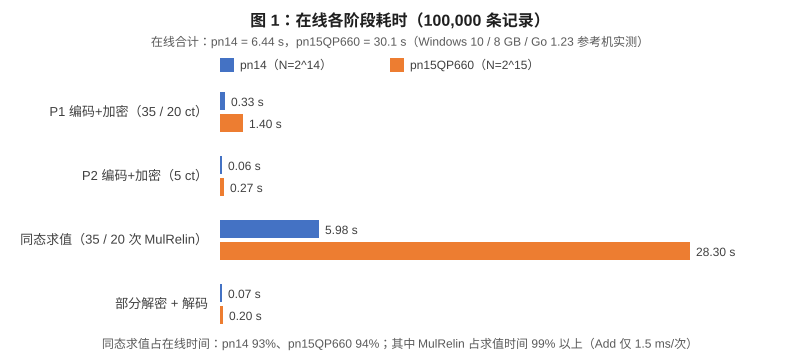
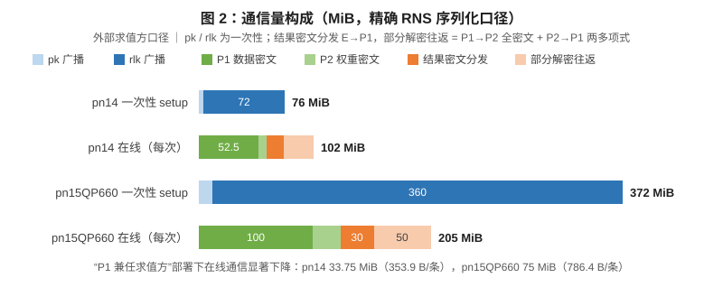
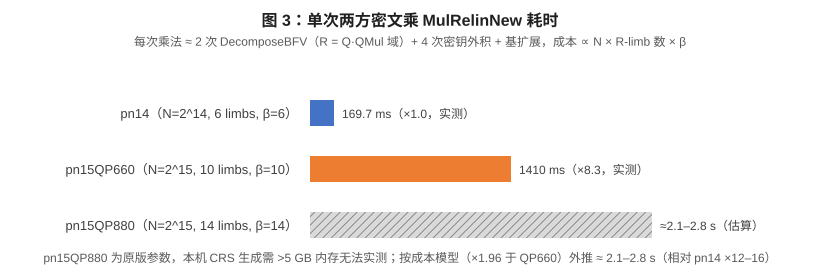
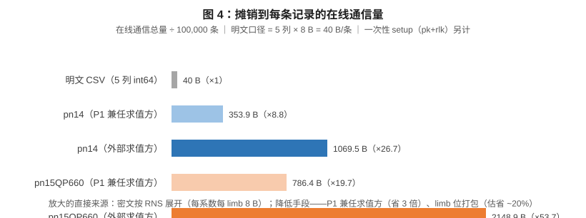

# MK-BFV 两方加权点积协议实测报告

> **日期**：2026-09 ｜ **数据来源**：`mkbfv` 库级基准（`TestMKBFVDotProduct`）与 `dotproduct` CSV CLI——两者共用同一协议实现 `mkbfv/dotproduct.go`，数字同源。
> **结论速览**：pn14 参数集下，10 万条 × 5 列私有数据的加权点积**在线耗时 6.44 s**、在线通信 **102 MiB**（外部求值方）/**33.75 MiB**（P1 兼任求值方），解密结果 **0 / 100,000 错误**。瓶颈为同态求值（占在线 93%），其中两方密文乘 MulRelin 占求值时间 99% 以上。
> 更深入的代码级与协议级分析见 `doc/dotproduct-report.md`；本报告聚焦实测数据与结论。

---

## 1. 被测对象：库与协议

### 1.1 软件栈

| 组件 | 版本 / 说明 |
|---|---|
| 密码库 | `mk-lattigo`（本仓库，KKLSS 多密钥 FHE 思路，eprint 2022/347） |
| 底层依赖 | Lattigo **v2.3.0**（RLWE/BFV 编解码、NTT、环运算） |
| 语言 / 运行时 | Go 1.23，纯 Go（无 cgo）；单进程顺序模拟 P1、P2 与求值方 |
| 测试机 | Windows 10 Home，8 GB 内存，低配参考机（Linux 高配机复测待补，见 §5.5） |

与分析直接相关的机制：

- **跨方密文乘** `MulAndRelinBFV`（mkbfv/keyswitch.go:115）：两操作数分属不同方时显式处理交叉项（202-216 行），重线性化融合在乘法内；
- **阈值解密** `PartialDecrypt`（mkrlwe/decryptor.go:26）：P2 先部分解密（P1 分量仍在，P2 对结果盲），P1 最后解密并解码，独得明文；
- **SIMD 批处理**：T ≡ 1 (mod 2N) 时每密文 N 个 slot，密文乘 = 明文逐 slot 乘。

### 1.2 协议流程（计时与通信量按此分阶段）

```
① 一次性 setup：双方 GenKeyPair + GenRelinearizationKey → 广播 pk + rlk
② P1：d1..d5 按 slot 打包，每列 ⌈100000/N⌉ 个密文 → 加密上传
③ P2：每个 wk 广播进全部 N 个 slot → 5 个密文上传
④ 求值方：res[j] = Σk MulRelinNew(Dk[j], Wk)（联合密钥 {P1,P2} 下）
⑤ 解密：P2 PartialDecrypt（盲）→ P1 PartialDecrypt + 解码（结果仅 P1 获得）
```

### 1.3 参数集与安全性

| 参数集 | N | Q | logQP | β | 来源 | T |
|---|---|---|---|---|---|---|
| pn14 | 2^14 | 6 limbs（319 bit） | 439 | 6 | **原版**（mkbfv 测试套件） | 按数据推导（2^44~2^53） |
| pn15QP660 | 2^15 | 10 limbs（540 bit） | 660 | 10 | 自原版 QP880 裁剪（适配 8 GB 内存） | 同上 |
| pn15QP880 | 2^15 | 14 limbs（750 bit） | 880 | 14 | 原版（本机 CRS >5 GB 未实测，仅估算） | 65537（原版） |

安全性小结（详细论证见问答记录与 `doc/dotproduct-report.md`）：

- 密钥/密文安全性由 **(N, logQP, σ)** 决定。pn14 原封未动，贴社区 128-bit 边界（N=2^14 → log q ≈ 438）；pn15QP660 仅减不增（660 < 881 边界），裁剪只牺牲噪声预算、不降安全性。
- **T 不进入 RLWE 困难度**，只决定明文范围与噪声预算。T 由数据范围自动推导（`MinT`/`FindPrimeT`），素性 ProbablyPrime(30)（误判 ≤ 4^-30），并硬约束 T ≤ Q[0]（lattigo 结构限制）。

## 2. 测试数据与方法

### 2.1 测试数据

- 确定性生成（`-seed 0xC0FFEE`）：P1 = 100,000 行 × 5 列 int64，|d| < 2^20；P2 = 单行 5 个权重，|w| < 2^20（`dotproduct/data/` 下 CSV）；
- 正确性对照：明文 int64 逐条计算 `res[i] = Σk dk[i]·wk` 全量比对。

### 2.2 明文模数 T 的推导

`T ≥ 4·K·maxD·maxW`（2× 安全余量），向上取最小 NTT 友好素数（T ≡ 1 mod 2^16）。本数据集 → T ≈ 2^44.4。极限探测：T ≈ 2^53、|d|,|w| ≤ 2^24 时仍 0 错误——**噪声不是瓶颈，T ≤ Q[0] ≈ 2^53 才是表示范围上限**（全范围 int64 需 CRT ×3，见 §5.3）。

### 2.3 计时与通信量口径

- **计时**：各阶段 wall-clock（含编码/NTT），单机顺序模拟，无真实网络；
- **通信量**：解析法精确 RNS 序列化——每系数每 limb 8 字节，不含协议头与网络栈开销；
- **"在线"** = 阶段 ②~⑤（不含一次性 setup 与 CRS 生成）。

### 2.4 复现命令

```bash
# 库级基准（与本报告数据同源）
go test ./mkbfv -run TestMKBFVDotProduct -v -timeout 30m -args -dotconf=pn14
GOGC=400 go test ./mkbfv -run TestMKBFVDotProduct -v -timeout 30m -args -dotconf=pn15

# 端到端 CSV CLI
go run ./dotproduct -gen                                    # 生成确定性数据
go run ./dotproduct -p1 data/p1_data.csv -p2 data/p2_weights.csv -out data/res.csv
GOGC=400 go run ./dotproduct -conf pn15 -p1 data/p1_data.csv -p2 data/p2_weights.csv -out data/res.csv

# 重新生成本报告图表（改 doc/gencharts/main.go 中常量后）
go run ./doc/gencharts
```

## 3. 测试结果

### 3.1 总览

| 指标 | pn14 | pn15QP660 | pn15QP880（估算） |
|---|---|---|---|
| 在线耗时 | **6.44 s** | 30.1 s | 50–60 s |
| setup 通信（一次性） | 76 MiB | 372 MiB | ~690 MiB |
| 在线通信（外部求值方） | **102 MiB**（1069.5 B/条） | 205 MiB（2148.9 B/条） | ~290 MiB |
| 在线通信（P1 兼任求值方） | **33.75 MiB**（353.9 B/条） | 75 MiB（786.4 B/条） | ~105 MiB |
| 单次 MulRelin | 169.7 ms | 1.41 s | 2.1–2.8 s |
| 正确性 | **0 / 100,000 错** | 0 / 100,000 错 | — |
| 峰值内存 | ~1.5 GB | ~4.5 GB | 8–10 GB（需 16 GB+ 机器） |

### 3.2 分阶段明细

**表 A：pn14**（N=16384，logQP=439，slots/ct=16384 → 每列 7 密文）

| 阶段 | 耗时 | 通信量 | 备注 |
|---|---|---|---|
| 0 参数+CRS 生成 | 2.2 s | 0 | 本地生成（种子可推导） |
| 1 双方 keygen | 0.33 s | 38 MiB/方，共 76 MiB | 一次性（pk 2 + rlk 36 MiB/方） |
| 2 P1 编码+加密 35 ct | 0.33 s | 52.5 MiB（P1→E） | |
| 3 P2 编码+加密 5 ct | 0.06 s | 7.5 MiB（P2→E） | |
| 4 求值：35 MulRelin + 28 Add | **5.98 s** | 0 | mul 169.7 ms/次，add 1.5 ms/次 |
| 5 E→P1 结果分发 7 ct ×3 poly | — | 15.75 MiB | |
| 5a/5b/5c 部分解密 ×2 + 解码 | 0.07 s | 15.75（P1→P2）+ 10.5 MiB（P2→P1） | |
| **在线合计** | **6.44 s** | **102 MiB（外评）/ 33.75 MiB（P1 兼任）** | 摊销 1069.5 B/条（外评） |

**表 B：pn15QP660**（N=32768，logQP=660，slots/ct=32768 → 每列 4 密文；GOGC=40 GOMEMLIMIT=6GiB）

| 阶段 | 耗时 | 通信量 |
|---|---|---|
| 0 参数+CRS 生成 | 25.1 s | 0 |
| 1 双方 keygen | 5.4 s | 186 MiB/方，共 372 MiB |
| 2 P1 编码+加密 20 ct | 1.4 s | 100 MiB（P1→E） |
| 3 P2 编码+加密 5 ct | 0.27 s | 25 MiB（P2→E） |
| 4 求值：20 MulRelin + 16 Add | **28.3 s**（1.41 s/次） | 0 |
| 5 部分解密+解码 | 0.2 s | 30（E→P1）+ 30（P1→P2）+ 20 MiB（P2→P1） |
| **在线合计** | **30.1 s** | **205 MiB**（外评）/ 75 MiB（P1 兼任） |

### 3.3 图表









图表由 `doc/gencharts/main.go` 从上述实测常量生成（`go run ./doc/gencharts`）；Linux 高配机复测后更新常量即可刷新。

## 4. 结果分析

### 4.1 时间瓶颈：求值占 93%，几乎全部在 MulRelin

- pn14：求值 5.98 s / 在线 6.44 s = **93%**；其中 35 次 MulRelin 共 5.94 s（99.3%），28 次 Add 仅 42 ms（1.5 ms/次）；pn15QP660 结构相同（94%）。
- 单次两方 MulRelin 的内部构成为 2 次 DecomposeBFV（R = Q·QMul 域，β 个 digit）+ 4 次密钥外积 + R 域张量积 + Quantize 基扩展。
- 加密、部分解密、解码合计 < 0.5 s——**优化只能从乘法下手**，加密/解密侧无优化空间。

### 4.2 pn14 与 pn15QP660 相差 8.3× 的构成

- 算法量 ∝ N × R-limb 数 × β：(2×) × (20/12) × (10/6) ≈ **5.6×**；
- 实测 1410 / 169.7 = **8.3×**，剩余 ~1.5× 为环境因素：pn15 活跃堆 ~4.5 GB，本机 8 GB 被迫 GOGC=40，GC 频繁扫描大堆 + cache/TLB 失效；
- 推论：Linux 大内存机（GOGC=200+）复测，pn15 预期降至 ~20 s，比值向 5.6× 收敛；pn14 数字基本不受环境影响。
- pn15 的 slot 摊销优势（32768/ct）在 10 万条规模无法兑现（密文仅省 43%，单次操作贵 8 倍）。

### 4.3 通信：放大 27~54 倍，大头可解释、可削减

- 每密文字节 = 2·N·QCount·8：pn14 1.5 MiB/ct、pn15QP660 5 MiB/ct → 摊每条记录 ∝ limb 数、与 N 无关 → **pn15 通信反而更大**；
- 一次性 rlk 36/180 MiB 每方，根因 β = QCount（gamma=2、alpha=1 导致分解粒度极细）；
- **P1 兼任求值方省 3×**（33.75 vs 102 MiB）：P1 的 35 个数据密文不上传、结果不经第三方转发。

### 4.4 数据适用边界

- 噪声余量充足：T ≈ 2^53、|d|,|w| ≤ 2^24 实测 0 错误（pn14）；
- 结构限制：T ≤ Q[0] ≈ 2^53 → 全范围 int64（乘积和可达 2^129）无法单次表示，需 CRT 拆 3 份（成本 ×3）；
- 环境声明：本机为低配参考机，pn15QP660 数字含明显 GC 拖累；正式性能数据以 Linux 复测为准。

## 5. 应用建议

### 5.1 参数选择

- **本规模（≤30 万条、深度 1 加权和）首选 pn14**：时间、通信、内存全面最优（6.44 s / 102 MiB / 1.5 GB），且 (N, logQP, σ) 为原版参数，安全性表述最直接；
- pn15QP660 仅当需要更深电路（噪声预算 660 vs 439 bit）、更多参与方或单批 >3 万条数据需要 32768 slot 打包时；
- pn15QP880 仅当合规要求严格使用原版参数集：预算在线 50–60 s、内存 16 GB+，或数据必须配原版 T=65537 时（此时需 CRT ×3）。

### 5.2 部署模式

- **首选 P1 兼任求值方**：在线通信 33.75 MiB（省 3×），结果不出 P1 本地；
- 外部求值方 + 流水线：P2 权重上传与 P1 数据加密可并行，端到端时间趋近求值时间（~6 s）；
- 解密顺序固定 P2→P1（保证 P2 对结果盲）；两种模式下 P2 均不获得任何中间明文。

### 5.3 数据范围管理

- CLI 已内置 T 按实际数据范围自动推导（`-tmin 0`），无需手工干预；盲目调大 T 只会无谓消耗噪声预算；
- 全范围 int64 输入：CRT 拆 3 个 < 2^53 份额并行计算再重构，在线耗时与通信按 ×3 估算（pn14 约 19.3 s / 306 MiB），正确性不受影响。

### 5.4 性能优化路线（按预期收益排序）

1. **权重密文 hoist 预分解**：Wk 被 ctsPerCol 次复用，但 `MulRelinNew` 每次对两操作数重新分解；预分解复用可省约一半分解开销，求值预计 -20~30%（需扩展 keyswitch API，rlkSet.HoistPool 为内部共享池）；
2. **批间并行**：不同列/批的 MulRelin 相互独立，当前实现单核顺序执行，应用层并发即可近线性加速；
3. **RNS limb 位打包**：每 limb 8 B 序列化改紧凑打包，通信估省 10~20%；
4. **setup 瘦身**：rlk 以种子传输 + 本地重构可省一次性通信 90%+（需安全评估）。

### 5.5 工程与复测

- Docker 镜像已备（工具箱式，`docker run -it` 进容器手动执行，命令清单见 `doc/dotproduct-report.md` §六）：Linux 高配机复测 `-reps 3` 后，更新本报告表格与 `doc/gencharts` 常量重新出图；
- GC：pn14 默认即可；pn15 建议 GOGC=200~400 且内存充足（≥12 GB）。

### 5.6 安全合规

- 保持 (N, logQP, σ) 原版三元组（pn14 已是），安全性即原版设计水平（~128-bit）；
- T 按数据推导不降安全性（不进 RLWE 困难度，仅影响噪声预算，实测验证）；
- 对外正式引用前，建议以 lattice-estimator 对 (N=2^14, log q=439, σ=DefaultSigma) 出具具体安全位数；
- 若必须全原版参数（含 T=65537）：换 pn15QP880 + CRT ×3，成本见 §3.1 估算列。

---

**附录：本报告相关文件**

| 文件 | 内容 |
|---|---|
| `mkbfv/dotproduct.go` | 协议实现（RunDotProduct / DotProductStats / FindPrimeT / MinT / 参数字面量） |
| `mkbfv/dotproduct_test.go` | 库级基准 |
| `dotproduct/main.go` + `dotproduct/data/` | CSV 端到端 CLI 与测试数据 |
| `doc/gencharts/main.go` → `doc/charts/fig1~fig4.svg` | 图表生成器与产物 |
| `doc/dotproduct-report.md` | 代码结构 / 协议设计 / 约束推导的深度分析报告 |
